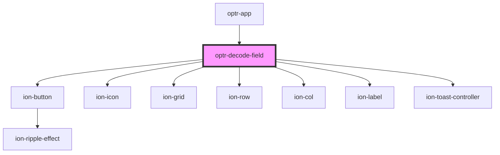

# optr-decode-field

<!-- Auto Generated Below -->

## Properties

| Property   | Attribute  | Description | Type      | Default |
| ---------- | ---------- | ----------- | --------- | ------- |
| `autofill` | `autofill` |             | `boolean` | `false` |
| `disabled` | `disabled` |             | `boolean` | `true`  |
| `value`    | `value`    |             | `string`  | `""`    |

## Events

| Event    | Description | Type               |
| -------- | ----------- | ------------------ |
| `onCopy` |             | `CustomEvent<any>` |

## Dependencies

### Used by

- [optr-app](../optr-app)

### Depends on

- ion-button
- ion-icon
- ion-grid
- ion-row
- ion-col
- ion-label
- ion-toast-controller

### Graph

---

_Built with [StencilJS](https://stenciljs.com/)_
