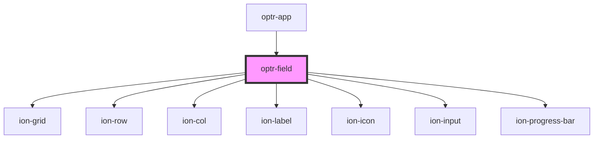

# optr-field

<!-- Auto Generated Below -->

## Properties

| Property            | Attribute            | Description | Type       | Default     |
| ------------------- | -------------------- | ----------- | ---------- | ----------- |
| `infoCallback`      | --                   |             | `Function` | `undefined` |
| `inputChange`       | --                   |             | `Function` | `undefined` |
| `label`             | `label`              |             | `string`   | `undefined` |
| `placeholder`       | `placeholder`        |             | `string`   | `undefined` |
| `strengthColor`     | `strength-color`     |             | `string`   | `undefined` |
| `strengthIndicator` | `strength-indicator` |             | `boolean`  | `undefined` |
| `strengthLabel`     | `strength-label`     |             | `string`   | `undefined` |
| `strengthValue`     | `strength-value`     |             | `number`   | `undefined` |
| `value`             | `value`              |             | `string`   | `undefined` |

## Dependencies

### Used by

- [optr-app](../optr-app)

### Depends on

- ion-grid
- ion-row
- ion-col
- ion-label
- ion-icon
- ion-input
- ion-progress-bar

### Graph

---

_Built with [StencilJS](https://stenciljs.com/)_
