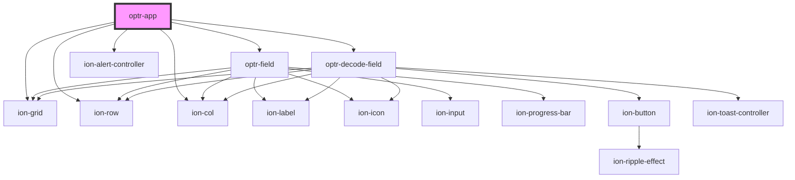

# app-home

<!-- Auto Generated Below -->

## Properties

| Property                | Attribute                  | Description | Type      | Default     |
| ----------------------- | -------------------------- | ----------- | --------- | ----------- |
| `autofill`              | `autofill`                 |             | `boolean` | `undefined` |
| `hashPassword`          | `hash-password`            |             | `string`  | `undefined` |
| `hashPasswordCrackTime` | `hash-password-crack-time` |             | `string`  | `undefined` |
| `modifier`              | `modifier`                 |             | `string`  | `undefined` |
| `password`              | `password`                 |             | `string`  | `undefined` |
| `passwordCrackTime`     | `password-crack-time`      |             | `string`  | `undefined` |
| `passwordEmpty`         | `password-empty`           |             | `boolean` | `true`      |
| `passwordScore`         | `password-score`           |             | `number`  | `undefined` |
| `passwordStrengthColor` | `password-strength-color`  |             | `string`  | `undefined` |
| `passwordStrengthLabel` | `password-strength-label`  |             | `string`  | `undefined` |
| `passwordStrengthValue` | `password-strength-value`  |             | `number`  | `undefined` |

## Dependencies

### Depends on

- ion-grid
- ion-row
- ion-col
- [optr-field](../field)
- [optr-decode-field](../decode-field)
- ion-alert-controller

### Graph

----------------------------------------------

*Built with [StencilJS](https://stenciljs.com/)*
